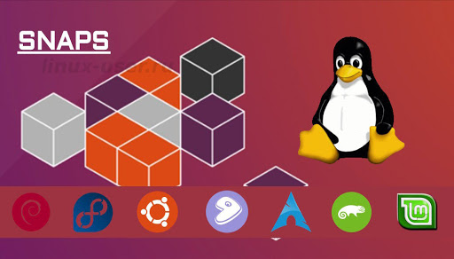
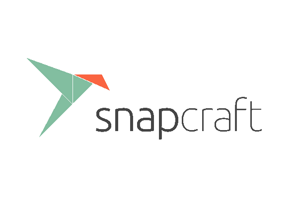
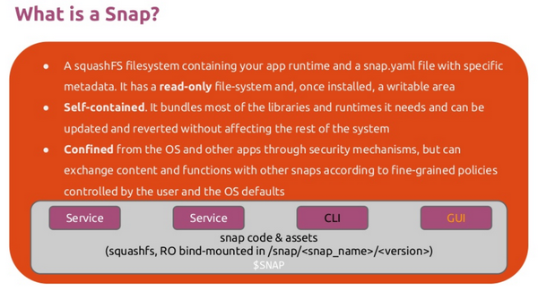
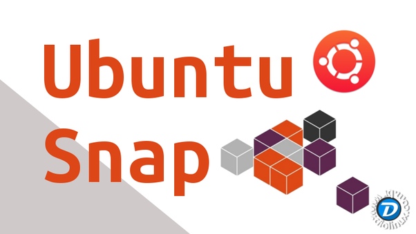

# Snap package
Package management without dependency hell as well as Docker for services. Not replacement deb/rpm system, supported in [20+ popular distributives](https://snapcraft.io/docs/installing-snapd). Use latest GUI app version in any distros and developers no need to compile a separate package for each distribution. Provide All-in-One containerised app will work on [most Desktop Linux OS](https://snapcraft.io/docs/installing-snapd). [Secure](https://snapcraft.io/blog/where-eagles-snap-snap-security-overview) and other isolation ([AppArmor & seccomp](https://core.docs.ubuntu.com/en/guides/intro/security)) add Mandatory Access Control (MAC).

# Installation
* Ubuntu:
```bash
sudo apt update
sudo apt install snapd
sudo apt install plasma-discover-snap-backend # KDE Discover integration
sudo snap install snap-store
sudo snap set system refresh.retain=2 # storage limit for previous app versions on disk
```
* Install snapd in other Linux distributives (similar simple): [snapd](https://snapcraft.io/docs/installing-snapd) and [Snap Store](https://snapcraft.io/snap-store).

# Advantages
## For users
Don't need for manual updates, all updates will be at night.
If you have installation/execution troubles in new distributive verison without support from original developer and - app may be snapcrafted without package maintainer.
## For developers

# Packages List
## Administator Tools
* [bashtop](https://snapcraft.io/bashtop)
* [kubectl](https://snapcraft.io/kubectl)
* [Termius](https://snapcraft.io/termius-app)
* [GNOME System Monitor](https://snapcraft.io/gnome-system-monitor)
* [htop](https://snapcraft.io/htop)
* [Docker](https://snapcraft.io/docker) (with docker-compose)
* [canonical-livepatch](https://snapcraft.io/canonical-livepatch): [setup live kernel updates](https://ubuntu.com/livepatch) without rebooting
* [Bitwarden](https://snapcraft.io/bitwarden)
* [Nextcloud](https://snapcraft.io/nextcloud)

## Productivity
* [Notepad++](https://snapcraft.io/notepad-plus-plus)
* [LibreOffice](https://snapcraft.io/libreoffice)
* [Sublime Text](https://snapcraft.io/sublime-text)
* [PyCharm CE](https://snapcraft.io/pycharm-community)
* [freecad](https://snapcraft.io/freecad)
* [Android Studio](https://snapcraft.io/android-studio)

## Web
* [Chromium](https://snapcraft.io/chromium)
* [Firefox](https://snapcraft.io/firefox)

## Multimedia
* [acestreamplayer](https://snapcraft.io/acestreamplayer)
* [FFmpeg](https://snapcraft.io/ffmpeg)
* [Blender](https://snapcraft.io/blender)
* [Inkscape](https://snapcraft.io/inkscape)
* [Spotify](https://snapcraft.io/spotify)
* [VLC](https://snapcraft.io/vlc)
* [Plex Media Server](https://snapcraft.io/plexmediaserver)
* [Shotcut](https://snapcraft.io/shotcut)

## Games
* [Xonotic](https://snapcraft.io/xonotic)

## Social
* [Slack](https://snapcraft.io/slack)
* [slack-term](https://snapcraft.io/slack-term)
* [Skype](https://snapcraft.io/skype)
* [Rocket.Chat Desktop](https://snapcraft.io/rocketchat-desktop)
* [Mattermost Desktop](https://snapcraft.io/mattermost-desktop)
* [Discord](https://snapcraft.io/discord)
* [Telegram Desktop](https://snapcraft.io/telegram-desktop)

## Education
* [kstars](https://snapcraft.io/kstars)
* [stellarium-plars](https://snapcraft.io/stellarium-plars)
* 
## Other
* [yandex-weather-cli](https://snapcraft.io/yandex-weather-cli)

# Video:
> [!VIDEO https://www.youtube.com/embed/MM6m2Ju7-lE]
> [!VIDEO https://www.youtube.com/embed/S3xRFnbVkvs]
> [!VIDEO https://www.youtube.com/embed/R6wrP-QEI3k]
> [!VIDEO https://www.youtube.com/embed/DLxqdf89hRo]


|Snappy supported in 20+ Linux Distributives|Software support without maintainer developers|What is Ubuntu Snaps?|Snap Developers Community and Platform|
|---------|---------|---------|---------|
|[](https://www.youtube.com/watch?v=MM6m2Ju7-lE "Ubuntu snaps: from Zero to Hero")|[](https://www.youtube.com/watch?v=S3xRFnbVkvs "Using snapcraft tracks to support software releases")|[](https://www.youtube.com/watch?v=R6wrP-QEI3k "An Introduction To Snaps")|[](https://www.youtube.com/watch?v=DLxqdf89hRo "Snaps and snapcraft.io explained in 3 minutes")|

# Links
* Snap Store: https://snapcraft.io/store
* Developers Portal: https://snapcraft.io/
* Tutorial: https://ubuntu.com/tutorials/create-your-first-snap
* Wikipedia: https://en.wikipedia.org/wiki/Snap_(package_manager)